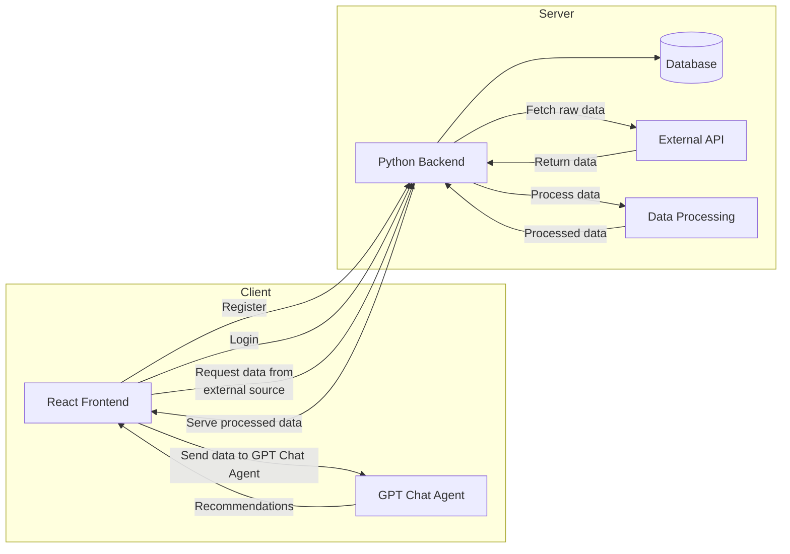

## Our Idea
HealthyTravels! ... is not just another Weather App.

Millions of people worldwide live with chronic health conditions that make them sensitive to environmental factors such as air pollution, temperature extremes, and humidity. These individuals face added challenges when planning travel — certain destinations or times of year may pose serious health risks.

We are developing a travel health platform that uses Earth observation and atmospheric data to offer personalized travel recommendations based on environmental suitability. The app helps users understand where and when it’s safe to travel, providing both forecast-based alerts and historical insights tailored to specific health conditions.

To begin, we are focusing on one of the most environmentally sensitive conditions: asthma. If successful, the platform will expand to support other conditions such as COPD, cardiovascular diseases, and heat-sensitive disorders.

## The Tech Stuff



## Requirements

- **Conda** (for the backend)

  ```bash
  # Install Miniconda (macOS/Linux)
  wget https://repo.anaconda.com/miniconda/Miniconda3-latest-Linux-x86_64.sh -O miniconda.sh
  bash miniconda.sh -b -p $HOME/miniconda
  export PATH="$HOME/miniconda/bin:$PATH"
  ```

- **Node.js** and **Yarn** (global)

  ```bash
  # Install Node.js
  # please visit https://nodejs.org/en/download

  # and then install Yarn:
  npm install -g yarn


  # Install Yarn globally
  npm install -g yarn
  ```

## Installation

Once you have the requirements installed, run the installation script:

```bash
# Creates the Conda environment, installs backend packages, and installs frontend packages
yarn inst
```

This will:

1. Create/update the Conda environment for the backend.
2. Install Python dependencies in the backend.
3. Install JavaScript dependencies in the frontend.

## Available Scripts

Below are the main commands defined in `package.json`:

| Script              | What it does                                   |
| ------------------- | ---------------------------------------------- |
| `yarn inst`         | Install both backend and frontend requirements |
| `yarn dev`          | Run backend and frontend in development mode   |
| `yarn backend:dev`  | Start backend in development mode              |
| `yarn frontend:dev` | Start frontend in development mode             |

all these scripts can executed from the root directory of the project

## Running the Project

Choose one of the following options:

- **Development (both)**:

  ```bash
  yarn dev

  ```

- **Start backend only**:

  ```bash
  yarn backend:start
  ```

- **Start frontend only**:

  ```bash
  yarn frontend:start

  ```
