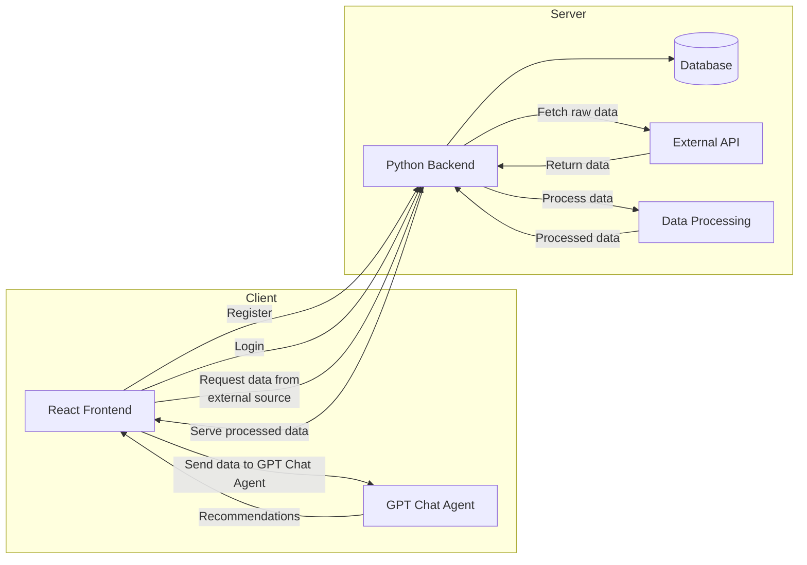

# JAWA: just another Weather App



## Requirements

- **Conda** (for the backend)

  ```bash
  # Install Miniconda (macOS/Linux)
  wget https://repo.anaconda.com/miniconda/Miniconda3-latest-Linux-x86_64.sh -O miniconda.sh
  bash miniconda.sh -b -p $HOME/miniconda
  export PATH="$HOME/miniconda/bin:$PATH"
  ```

- **Node.js** (>=14.x) and **Yarn** (global)

  ```bash
  # Install Node.js via nvm (recommended)
  nvm install --lts

  # Install Yarn globally
  npm install -g yarn
  ```

## Installation

Once you have the requirements installed, run the installation script:

```bash
# Creates the Conda environment, installs backend packages, and installs frontend packages
yarn inst
```

This will:

1. Create/update the Conda environment for the backend.
2. Install Python dependencies in the backend.
3. Install JavaScript dependencies in the frontend.

## Available Scripts

Below are the main commands defined in `package.json`:

| Script              | What it does                                   |
| ------------------- | ---------------------------------------------- |
| `yarn inst`         | Install both backend and frontend requirements |
| `yarn dev`          | Run backend and frontend in development mode   |
| `yarn backend:dev`  | Start backend in development mode              |
| `yarn frontend:dev` | Start frontend in development mode             |

all these scripts can executed from the root directory of the project

## Running the Project

Choose one of the following options:

- **Development (both)**:

  ```bash
  yarn dev

  ```

- **Start backend only**:

  ```bash
  yarn backend:start
  ```

- **Start frontend only**:

  ```bash
  yarn frontend:start

  ```
