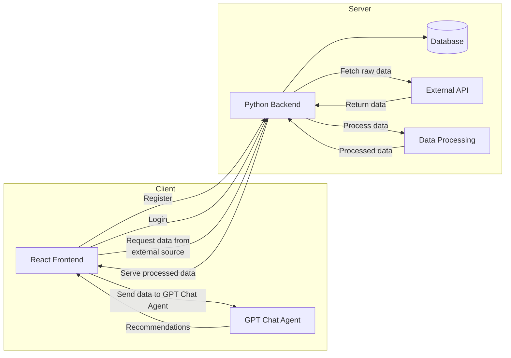

```mermaid
flowchart LR
    subgraph Client
      FE[React Frontend]
      Chat[GPT Chat Agent]
    end

    subgraph Server
      BE[Python Backend]
      DB[(Database)]
      API[External API]
      Proc[Data Processing]
    end

    %% Client actions
    FE -->|Register<br>| BE
    FE -->|Login<br>| BE
    FE -->|Request data from<br>external source| BE

    %% Server external fetch and processing
    BE -->|Fetch raw data| API
    API -->|Return data| BE
    BE -->|Process data| Proc
    Proc -->|Processed data| BE

    %% Persisting
    BE --> DB

    %% Serve processed data
    BE -->|Serve processed data| FE

    %% Frontend GPT interaction
    FE -->|Send data to GPT Chat Agent| Chat
    Chat -->|Recommendations| FE
```
